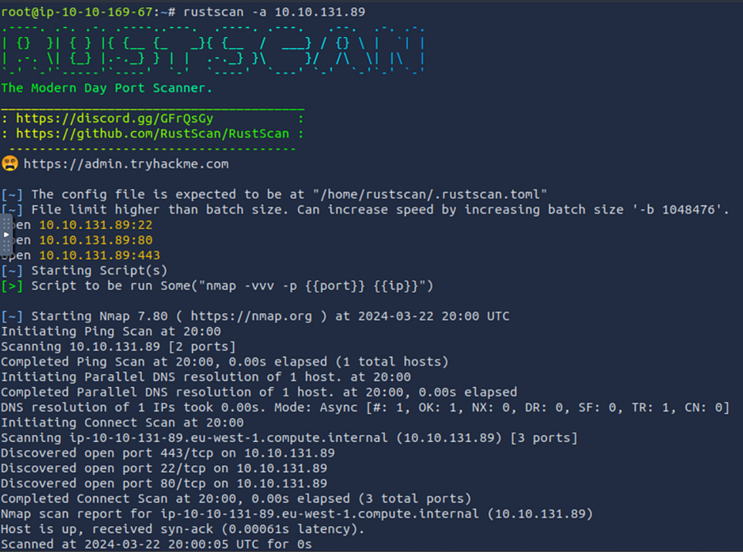

# 🚘 Dodge

Dodge-TryHackMe (Write-Up)

_Test your pivoting and network evasion skills_

from TryHackMe

Link to the room: [https://tryhackme.com/room/dodge](https://tryhackme.com/room/dodge)\
Difficulty: Medium\
Tags: Web, Network evasion, Pivoting, Firewall

_It is a subscriber room. Non-subscribed, free users are unable to enter this room._

Dodge is a recently released CTF room. At the time this walkthrough was written, the room had only been up for 80 days, and 871 people were trying to beat it.

REMINDER:

_I will not be sharing the THM{} flags across the write up but the write up will still guide you across the how to and where's. If you get stuck just follow or read along and I am sure you can get the flags as well._

1: Dodge-Introduction:

Welcome to the network evasion challenge, which is a component of the TryHackMe Red Teaming Path campaign.\
Begin by putting the equipment into operation. In order to deploy the virtual machine for this room, you will need to click on the _Start Machine_ button that is located in the upper-right corner of the task.

Note:

Please give the system between 4 to 6 minutes to completely power up.

2: Dodge — Task (Q/A)

_What is the content of user.txt?_

_What is the content of root.txt?_

3: Dodge — Let’s Run Machine

In the first place, it is imperative that the machine be started up, and as is customary, I am doing it from the Attackbox since that is the most convenient.

When the computer has finished spinning up and you have received the IP address for the machine, everything is ready to go. \
&#x20;\
Following the conclusion of the previous year, I began using “Rustscan” rather than “nmap” whenever I was ready to do so. I was able to locate it considerably more quickly. Because of this, you shouldn’t be surprised if you start seeing rust in my writing from now on. \
&#x20;\
The next step is to do a rust scan on this system. This is a type of blend of a command line, and the command looks like the following:

first partial section of the Rustscan

<figure><figcaption></figcaption></figure>

second partial section of the Rustscan output

<figure><figcaption></figcaption></figure>

So we can see 3 ports: 22 (SSH), 80 (http), and 443 (https).

Next step: let's see what’s on it.

<figure><figcaption></figcaption></figure>

forbidden with Ip address

So, let’s go forward. Following the identical procedure using the https protocol, I was able to obtain the same result.

Then I thought what if I add the IP and the DNS name to the “vim /etc/hosts” file. Simple task no huff lets give it a shoot.

<figure><figcaption></figcaption></figure>

<figure><figcaption></figcaption></figure>

SSL Certificate:

Main domain: dodge.thm

Subdomains: www.dodge.thm, blog.dodge.thm, dev.dodge.thm, touch-me-not.dodge.thm, netops-dev.dodge.thm, ball.dodge.thm

Only [www.dodge.thm,](http://www.dodge.thm,) dev.dodge.thm, and netops-dev.dodge.thm were accessible to us among these services. All of the others were prohibited.

<figure><figcaption></figcaption></figure>

<figure><figcaption></figcaption></figure>

<figure><figcaption></figcaption></figure>

<figure><figcaption></figcaption></figure>

www.dodge.thm source code included no information, and there were no specific versions of technologies utilized on this site that might be exploited. \
&#x20;

\
There was a PHP Info Page on the dev.dodge.thm domain.&#x20;

<figure><figcaption></figcaption></figure>

&#x20;

\
The netops-dev.dpdge.thm file included no content. Nevertheless, the subject of the HTTP request read: Firewall—UUpload Logs. After reviewing the source code, we discovered the following:

source code

This HTML code references two JavaScript files: cf.js and firewall.js.\
Firewall.js seems like it may be intriguing. Upon further investigation, an endpoint with the name firewall10110.php was discovered:

<figure><figcaption></figcaption></figure>

Accessing this endpoint:

<figure><figcaption></figcaption></figure>

Note: I Already allowed port 21 to allow in

So, it seems that we are able to: The acronym “UFW” on the screen refers to “Ubuntu Firewall.” \
&#x20;\
On this page, you can find a lot of really useful information on UFW commands.

[UFW Essentials: Common Firewall Rules and Commands | Digital Ocean\
_UFW (uncomplicated firewall) is a firewall configuration tool that runs on top of iptables, included by default within..._www.digitalocean.com](https://www.digitalocean.com/community/tutorials/ufw-essentials-common-firewall-rules-and-commands)

Now, to allow FTP, we need to enter

From our nmap scan, we knew that we had ports 22, 80, & 443 open (due to the UFW rules), but not port 21—FFTP. We can modify this rule: 21 DENY IN Anywhere to allow incoming connections to the FTP port.

UFW Command: sudo ufw allow ftp

Upon running this command, the rules got updated, and now the action is ALLOW IN for FTP:

Now that FTP is enabled, you can guess what we're going to do:

Confirming the same through an Nmap Scan

<figure><figcaption></figcaption></figure>

nmap -p21

And yes, Anonymous is enabled so its an easy log-in.

<figure><figcaption></figcaption></figure>

Connecting to the server

Let's see the files within.

Directory listing:

<figure><figcaption></figcaption></figure>

Now, if you examine more closely, you will notice that there is a catch. This is the only file that we are able to read. You are unable to download it.

Ok, step 2: as “ls -la,” always check the hidden files.

<figure><figcaption></figcaption></figure>

We are quite familiar with the bash history. On the other hand, the only issue is that I signed in from my machine’s home root base or whatever, and if I receive this there, it will screw up my system. Therefore, let us log out of the FTP server and make a folder from which we may get this information.

<figure><figcaption></figcaption></figure>

Now that we have it we can check the hidden bash.

<figure><figcaption></figcaption></figure>

Despite the fact that I don’t know much, let’s simply keep this in mind for when we might need it in the future. Maybe not, though. At this point, we do not know. \
&#x20;\
It is time to move on. Keep in mind the files that are hidden:) \
&#x20;\
We will be able to view the “.ssh” folder if we continue to browse. This is not good. This is not good.

The .ssh directory had these files:

<figure><figcaption></figcaption></figure>

So we are able to obtain two of the three files. We are going to get them.

<figure><figcaption></figcaption></figure>

Additional material to work with. After that, let’s have a look at the contents of these files.

<figure><figcaption></figcaption></figure>

During the process of validating the auth\_keys file, I came across the user “Challenger.” I had already altered the permissions for the id\_rsa\_file so that it might be utilized at a later time. \
&#x20;\
Let us make an attempt to use the backup file with this user logged in to the SSH server.

Alright, so it was successful.\
We kind of bypassed half of the planet to get here, but it’s a minor win.

Now we have the flag. Now, let’s have a look at what else we can discover here and who else we may locate.

<figure><figcaption></figcaption></figure>

We could discover these users with a little amount of searching, and the cobra appears to be interesting. As a result of my investigation, I discovered that at the moment we are unable to make significant progress, necessitating that we return to the challenger position.

<figure><figcaption></figcaption></figure>

Lets try to find these files.

challenger@thm-lamp:\~$ find / -type f -name setup.php 2>/dev/null\
/var/www/notes/api/setup.php\
challenger@thm-lamp:\~$ find / -type f -name posts.php 2>/dev/null\
/var/www/notes/api/posts.php\
challenger@thm-lamp:\~$

All of them are in the same location, which is incredible. Let’s have a look at them.\
I attempted to use the setup.php file, but I was unable to locate anything that was interesting.\
Second, the posts.php file.

<figure><figcaption></figcaption></figure>

 

<figure><figcaption></figcaption></figure>

 

<figure><figcaption></figcaption></figure>

When we finally get our hands on the decoded post, we will discover that it is actually a post containing cobra credentials.

Let’s go over to his account.

<figure><figcaption></figcaption></figure>

 

<figure><figcaption></figcaption></figure>

Now since we got in with a password lets try “sudo -l” with cobra.

So yes usual from here go to GTFObins.

[GTFOBins\
_GTFOBins is a curated list of Unix binaries that can be used to bypass local security restrictions in misconfigured…_gtfobins.github.io](https://gtfobins.github.io/?source=post\_page-----30a0ddd03fb1--------------------------------)

And search for APT and look for the Sudo options.

<figure><figcaption></figcaption></figure>

Since we have a working existing shell I used the c option.

root flag

And we have the root flag as well.

<figure><figcaption></figcaption></figure>

Challenge complete. Thanks for reading!

&#x20;
